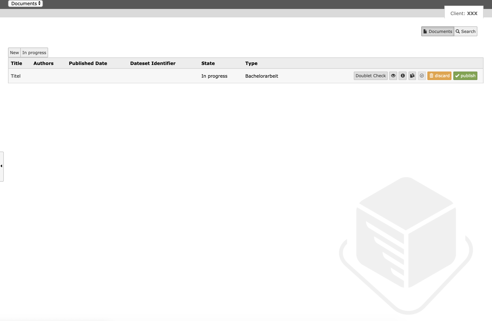

.. ==================================================
.. FOR YOUR INFORMATION
.. --------------------------------------------------
.. -*- coding: utf-8 -*- with BOM.

.. _introduction:

Introduction
============

.. _about:

About Kitodo.Publication
------------------------

Kitodo.Publication is a typo3 extension and can be used to record for example publications or other documents.
The metadata are recorded with a configured form, which is shown in the frontend.
Every document type can base on different configurations. The recorded data are saved in the typo3 backend and can be published to a repository after the data is checked.

.. _screenshots:

Screenshots
-----------

Some Screenshots from Kitodo.Publication BE and FE

   Kitodo.Publication Manager