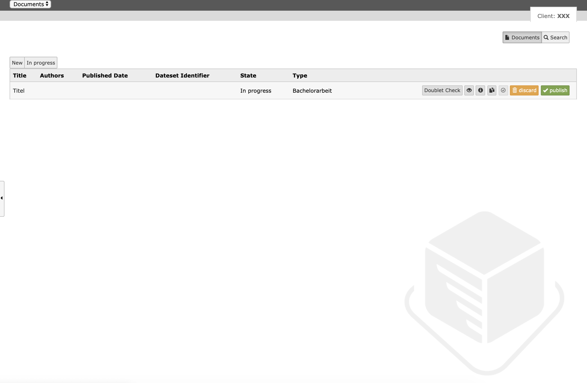
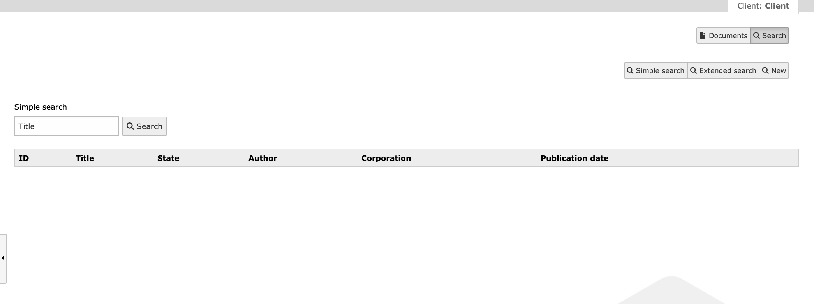

.. ==================================================
.. FOR YOUR INFORMATION
.. --------------------------------------------------
.. -*- coding: utf-8 -*- with BOM.

.. _user-manual:

Users Manual
============

Manager
-------

.. tip::

    With this manager you have two different (and a bit intransparent) workspaces.
    The first workspace is the local workspace. Documents which are created are existing in the local workspace only, until you publish a document.
    If the document is published it is deleted in the local workspace and exists in the repository workspace only.
    Now it gets a bit tricky. A published document can get imported into the local workspace from the repository.
    This import is a copy of the published document and every changes made are getting active when this document is published.

* Documents
    * Doublet check
        * Checks if doublets exists for the given document
    * Preview
        * Shows a preview (Kitodo.Presentation) in the frontend
    * Download datacite xml
        * ?
    * Duplicate
        * Duplicates the given document
    * Discard
        * Discards the given document
    * Publish
        * Publishes the new or changed document by sending it to fedora

   Manager view

* Search
    * Simple
        * Simple search
    * Extended
        * Extended search
    * New
        * Shows the latest published document

.. important::

   Documents which are not existing in the local workspace, can be imported with the "get" button on the right side of the search list

   Manager search view