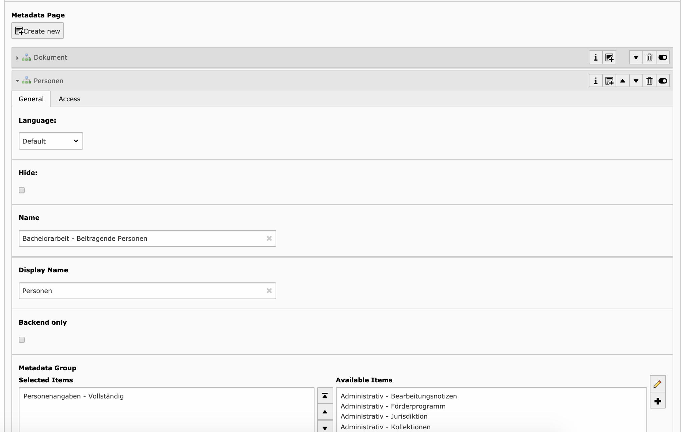

.. ==================================================
.. FOR YOUR INFORMATION
.. --------------------------------------------------
.. -*- coding: utf-8 -*- with BOM.

.. _configuration:

Configuration document types
=============================

This part of the documentation describes how a document type can be configured.

.. _configuration-document:

Document type
--------------------

Description of document type

* virtualType
* MetadataPage

Each document type can have an own configuration but it is also possible to use existent configurations or in this case metadata pages.
The matadata pages are displayed as tab element and they are used to structure the form elements for the user.

   Documenttype configuration (metadata pages)

.. _configuration-page:

Metadata page
--------------------

Description of metadata page

* BackendOnly
* MetadataGroups

Each of this pages can have several metadata groups. These groups are used to combine metadata objects together if they are in the same mods parent element.
See the example below in "How to use xpath to write Mods"

.. _configuration-group:

Metadata group
--------------------

Description of metadata group

Each of this groups can have several metadata objects. These objects are generated inside of the group element.
See the example below in "How to use xpath to write Mods"

* Mandatory
   * If activated the whole group is mandatory, so all form fields needs to be filled out.
* Mapping for reading
   * In some cases the reading location is different from the writing location. So this option can be used with a reading xpath.
* Mapping
   * ?
* Mods extension mapping
   * ?
* Max iteration
   * With this option the number of maximum group iterations are defined

* BackendOnly
   * This group is only displayed in the backend.

.. _configuration-object:

Metadata object
--------------------

Description of metadata object

* Max Iteration
   * With this option the number of maximum object iterations are defined
* Mandatory
   * If activated the object is mandatory, so it needs to be filled out.
* DataType
   * ?
* Validation
   * Configures the validation type for this object
* Mapping
   * ?
* Mods Extension field
   * ?
* Input Field
   * The following input types are available:
      * input
      * textarea
      * select
      * checkbox
      * hidden
      * input with dropdown
* input option list
   * ?
* fill out service
   * ?
* default value
   * ?
* backend only
   * This object is only displayed in the backend.
* consent field
   * ?

.. _configuration-xpath:

How to use xpath to write Mods
-------------------------------

There are two places (groups and objects) in the configuration data where the xpath is needed to describe where a value is located in the mods format.
In other cases xpath is only for reading in xml data. But in this case we use it to write data.

The group defines location inside the mods and every object gets written inside the group location.
For example:

+----------------+------------------+
| Parameter      | xpath            |
+================+==================+
| group          | mods:name        |
+----------------+------------------+
| object1        | mods:namePart    |
+----------------+------------------+
| object2        | mods:displayForm |
+----------------+------------------+

This example would generate the following xml:

.. code-block:: xml
   :linenos:

   <mods:mods>
      <mods:name>
         <mods:namePart>someValue</mods:namePart>
         <mods:displayForm>someValue</mods:displayForm>
      </mods:name>
   </mods:mods>

.. important::

   Not all xpath operators which are available for reading are also available for writing. So here are some examples:
